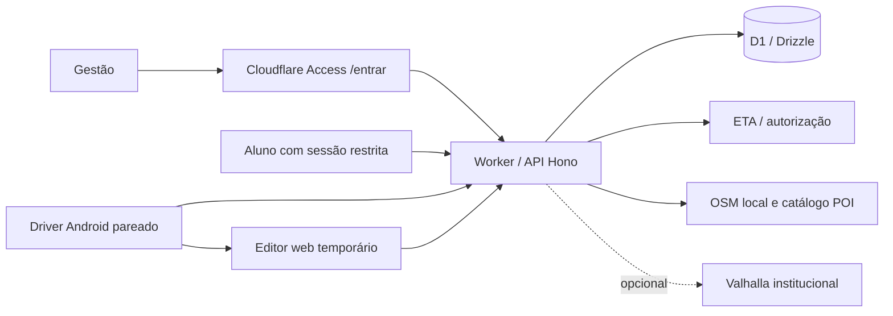

# Arquitetura TrackBus
React19/TypeScript estrito no shell Vinext/Vite existente. React Router organiza a aplicação, TanStack Query sincroniza dados, RHF e Zod validam formulários/entrada. MapLibre renderiza mapas, Drizzle/Hono atendem Cloudflare Workers+D1. Expo58/React Native cuidam do Driver.

V11 mantém essa arquitetura. `Map.tsx` seleciona MapLibre/Google por configuração segura; Google SDK/Places é carregado sob demanda e Routes fica no backend. `worker.scheduled` processa alertas e fila cifrada em D1 com lotes pequenos. GPS não executa distribuição de notificações. Não foram adicionados microserviços, plano pago ou servidor permanente. [Google](GOOGLE_MAPS.md) · [Push](WEB_PUSH.md) · [Desempenho](PERFORMANCE.md).

```mermaid
flowchart LR
  Admin[Gestão] --> Access[Cloudflare Access /entrar]
  Access --> API[Worker / API Hono]
  Aluno[Aluno com sessão restrita] --> API
  Driver[Driver Android pareado] --> API
  Driver --> Editor[Editor web temporário]
  Editor --> API
  API --> D1[(D1 / Drizzle)]
  API --> Dominio[ETA / autorização]
  API --> Geo[OSM local e catálogo POI]
  API -. opcional .-> Provedor[Valhalla institucional]
```

worker/index.ts é entrypoint, app/api/[...path]/route.ts encaminha para apps/api. apps/web/App.tsx preserva módulos administrativos e telas por papel; apenas admin, motorista e aluno têm acesso; SmartJourney.tsx atende aluno/visitante. packages/domain contém funções puras, packages/validation schemas, packages/geodata malhas e catálogo IBGE. apps/driver é pacote separado para respeitar versões Expo/React.

Consulta adaptativa na web: 5s com viagem ativa, 15s quando sem execução, sem polling em aba oculta. Native limita envios a5s, guarda somente a leitura pendente recente. D1 mantém posição atual e eventos operacionais; não guarda trajetória pessoal do aluno. Não há WebSocket/Durable Object nem servidor de roteamento pesado. Avaliar filas/outbox e canais persistentes só com métricas que justifiquem custo/complexidade.

Rotas e versões são agregados JSON; viagens usam snapshot. API deriva instituição da sessão, nunca de um campo livre do formulário. Favoritos são preferências separadas de matrículas/vagas. GPS e simulação não misturam fonte na mesma viagem.

Dados OSM locais dispensam serviço externo apenas no recorte conectado; tiles e sincronização continuam exigindo internet. Cloudflare próprio usa Access verificado. Sites privado e gateway opcional preservam compatibilidade, mas não participam da implantação atual. Restrições em DEPLOYMENT.md e SECURITY.md.

Editor separado em RouteEditor.tsx, com histórico local limitado a 50 mudanças e consultas POI no servidor. Rascunho → análise → aprovação/devolução; publicação é exclusiva da gestão. O Driver abre a web com um código efêmero de uso único; o token nativo não entra no navegador.
